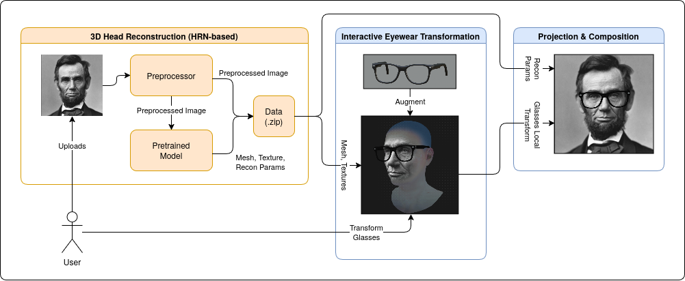

# TryGlasses: Virtual Eyewear Simulation on Portrait Images



TryGlasses is a web application designed to simulate wearing eyewear using 3D rendering.

## Usage

There are two distinct steps for TryGlasses: (1) HRN Inference for head reconstruction and (2) Interactive 3D view with WebGL.

### HRN Inference

[](https://colab.research.google.com/github/secona/tryglasses-web/blob/master/notebooks/hrn_head_reconstruction.ipynb)

We provide the notebook for HRN inference at [`notebooks/hrn_head_reconstruction.ipynb`](notebooks/hrn_head_reconstruction.ipynb). The authors run the notebook using Google Colab. Use this notebook to transform your 2D image to data for the frontend WebGL using HRN-based head reconstruction.

### Frontend WebGL

#### Prerequisites

Ensure the following software is installed on your local environment before proceeding:
- Node.js: Version 22.21.1
- NPM: Version 10.9.4

#### Steps

1. Clone the repository to your local machine.
2. Navigate to the project directory.
3. Install the required dependencies:
   ```bash
   npm install
   ```

To start the local development server:

```bash
npm run dev
```

## Attributions

This project uses external assets.

### 3D Models
- https://free3d.com/3d-model/frame-glasses-314946.html
- https://free3d.com/3d-model/heart-glasses-v1--264833.html
- https://free3d.com/3d-model/snowflakes-v1--581116.html

### Textures
- https://ambientcg.com/view?id=Ground080
- https://ambientcg.com/view?id=Onyx015

### Portrait Examples
- https://commons.wikimedia.org/wiki/File:Abraham_Lincoln_O-77_matte_collodion_print.jpg
- https://commons.wikimedia.org/wiki/File:Tracy_Caldwell.jpg
- https://commons.wikimedia.org/wiki/File:President_Barack_Obama.jpg

## Acknowledgements

Thank you to the following for their contributions and resources:
- The developers of the open-source libraries used in this project.
- The creators of the 3D assets.
- The authors of [Hierarchical Representation Network (HRN)](https://github.com/youngLBW/HRN)

## License

This project's source code (frontend WebGL logic and notebook scripts) is released under the MIT License.

> [!IMPORTANT]
> While the source code in this repository is permissive, the inference backend relies on third-party
> libraries (such as `nvdiffrast`) with strict licensing constraints. See each of them to know more.
